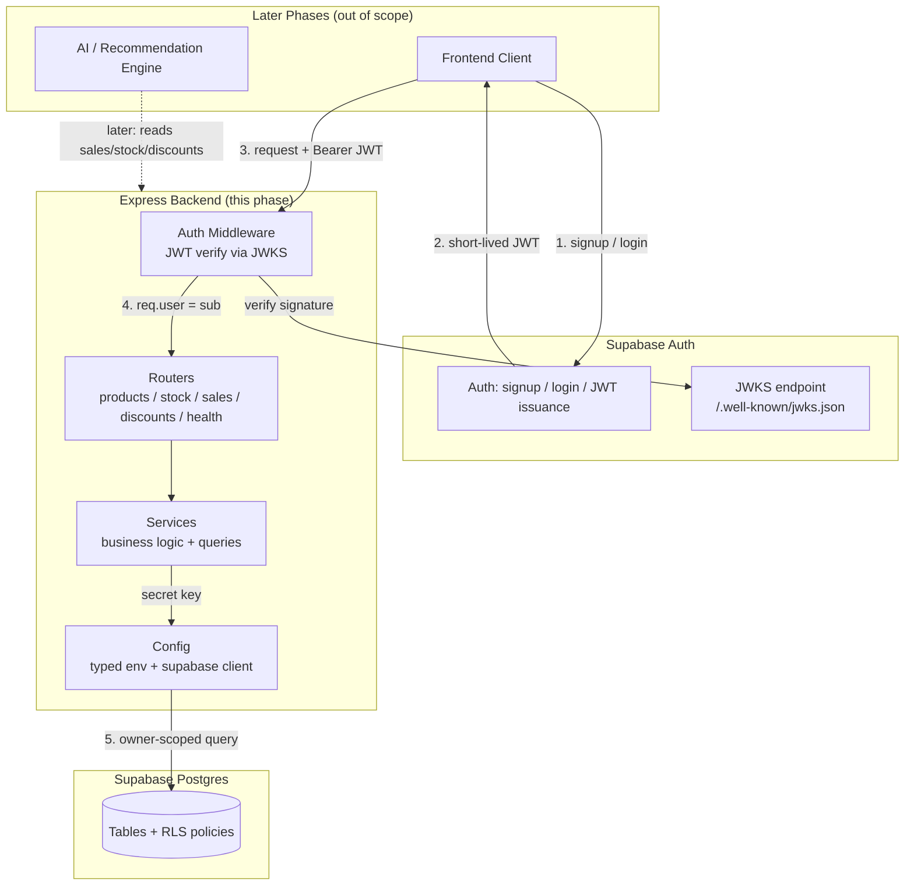
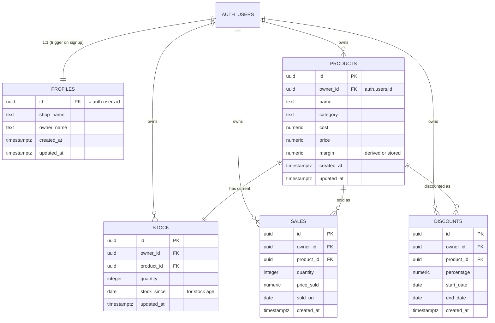

# Design Document: Supabase Backend Integration

## Overview

This feature establishes the backend/database/auth foundation for **Kapanin**, an AI-based Decision Support System that recommends when and how much small retail store owners (UMKM) should discount products. This phase delivers a stateless **Node.js + Express + TypeScript** API service backed by **Supabase** (managed Postgres + Supabase Auth).

The design is deliberately scoped as a *foundation phase*. It provides authenticated, owner-scoped CRUD over the core retail data (products, stock, sales, discounts) that the AI model and the frontend will later build on. **The frontend and the AI/recommendation engine are explicitly out of scope for this phase** and are referenced only where they constrain the backend contract.

Authentication is **Supabase-centric**: the (future) client authenticates directly against Supabase Auth and receives a short-lived JWT. The backend never issues or stores sessions — it verifies each incoming JWT against the Supabase project's JWKS endpoint and then executes owner-scoped queries. Row Level Security (RLS) in Postgres is the final, defense-in-depth guarantee that an owner can only ever touch their own rows, even if the application layer has a bug.

Three design pillars run through every section:
- **Security** — JWT verified via asymmetric keys (JWKS), privileged secret key kept server-only and git-ignored, RLS on every data table, FK integrity that respects owner scoping.
- **Testability** — `app.ts`/`server.ts` split so the app is importable without binding a port, dependency-injectable Supabase client, a vertical slice (Products) that serves as the reusable template, and an end-to-end integration test (signup → token → create → read back).
- **Portability** — all schema lives as SQL migration files in the repo, so the project can move from hosted Supabase to local/CLI without rework.

## Architecture



**Request lifecycle (protected route):**
1. Client authenticates with Supabase Auth directly and obtains a JWT.
2. Client calls the Express backend with `Authorization: Bearer <jwt>`.
3. Auth middleware verifies the JWT signature against the cached JWKS and checks expiry.
4. On success, `req.user` is populated from the token `sub` claim (the owner's `auth.users` id).
5. The service layer queries Supabase using the secret key; RLS policies constrain rows to the authenticated owner.

**Statelessness:** the backend holds no session state. The only cached state is the JWKS key set (bounded ~10-minute cache), which is derived, non-sensitive, and refreshable.

## Components and Interfaces

### Component: Config (`src/config`)

**Purpose:** Load and validate environment configuration once at startup (fail fast), and construct the Supabase client.

**Responsibilities:**
- Parse and validate env vars; throw on missing/invalid values before the server starts.
- Expose a typed, frozen config object.
- Create a singleton Supabase client using the **secret** key.

**Interface:**
```typescript
interface AppConfig {
  readonly port: number;
  readonly supabaseUrl: string;
  readonly supabaseSecretKey: string;   // server-only, never logged
  readonly supabaseJwksUrl: string;     // derived from supabaseUrl
  readonly nodeEnv: 'development' | 'test' | 'production';
  readonly corsOrigins: string[];
}

function loadConfig(env: NodeJS.ProcessEnv): AppConfig;      // pure, throws on invalid
function createSupabaseClient(config: AppConfig): SupabaseClient;
```

### Component: Auth Middleware (`src/middleware/auth.ts`)

**Purpose:** Verify the Supabase JWT and attach the authenticated owner to the request.

**Responsibilities:**
- Extract the Bearer token from the `Authorization` header.
- Verify signature against the remote JWKS (cached) using `jose`.
- Validate expiry and issuer.
- Populate `req.user = { id, email? }`; respond `401` otherwise.

**Interface:**
```typescript
interface AuthenticatedUser {
  id: string;        // auth.users.id, from JWT `sub`
  email?: string;
}

// Express augmentation: req.user?: AuthenticatedUser
function createAuthMiddleware(deps: { jwksUrl: string }): RequestHandler;
```

### Component: Error Handling Middleware (`src/middleware/error.ts`)

**Purpose:** Centralized, consistent error responses.

**Responsibilities:**
- Map known error types (`ValidationError`, `AuthError`, `NotFoundError`, `ForbiddenError`) to HTTP status codes.
- Avoid leaking internals or secrets in responses; log full detail server-side.

**Interface:**
```typescript
class AppError extends Error { constructor(public status: number, message: string, public code?: string) }
function errorHandler(): ErrorRequestHandler;
```

### Component: Routers (`src/routes`)

**Purpose:** HTTP surface. Thin — validate input, call a service, shape the response.

**Responsibilities:**
- `health` — unauthenticated liveness/readiness.
- `me` — protected; returns the authenticated owner's profile.
- `products`, `stock`, `sales`, `discounts` — protected CRUD, all owner-scoped.
- Validate request bodies/params with `zod` before touching services.

### Component: Services (`src/services`)

**Purpose:** Business logic and all Supabase queries. The only layer that talks to the database.

**Responsibilities:**
- Enforce owner scoping in every query (`owner_id = req.user.id`) as application-layer defense (RLS is the backstop).
- Enforce cross-entity invariants (e.g., a sale/stock/discount row references a product owned by the same owner).
- Translate DB errors into `AppError`s.

**Representative interface (Products — the template slice):**
```typescript
interface ProductService {
  list(ownerId: string): Promise<Product[]>;
  getById(ownerId: string, id: string): Promise<Product | null>;
  create(ownerId: string, input: NewProduct): Promise<Product>;
  update(ownerId: string, id: string, patch: ProductPatch): Promise<Product>;
  remove(ownerId: string, id: string): Promise<void>;
}
```

### Component: Types (`src/types`)

Shared TS types for domain entities and DTOs, kept in sync with the migration schema.

## Data Models



**Validation / integrity rules:**
- All PKs are UUID (`gen_random_uuid()`), except `profiles.id` which equals `auth.users.id`.
- Every data table has `owner_id` referencing `auth.users(id)` with `on delete cascade`.
- `product_id` FKs reference `products(id)`. **Owner scoping on FKs** is enforced so a row cannot reference another owner's product — implemented via composite FK `(owner_id, product_id)` against a unique `products(id, owner_id)` constraint (see migration sketch), plus RLS.
- `quantity >= 0`; `percentage` in `(0, 100]`; `price >= 0`, `cost >= 0`; `end_date >= start_date`.
- `created_at`/`updated_at` default `now()`; `updated_at` maintained by trigger.

## Key Functions with Formal Specifications

### `loadConfig(env)`

```typescript
function loadConfig(env: NodeJS.ProcessEnv): AppConfig
```
**Preconditions:** `env` is provided (may be incomplete).
**Postconditions:**
- Returns a frozen `AppConfig` **iff** all required vars are present and well-formed.
- Throws a descriptive error (naming the offending var, never its value) otherwise.
- Pure: no I/O, no mutation of `env`.

### `createAuthMiddleware(deps)` → handler

```typescript
function createAuthMiddleware(deps: { jwksUrl: string }): RequestHandler
```
**Preconditions:** `deps.jwksUrl` is a valid https URL.
**Postconditions:**
- Calls `next()` with `req.user` set **iff** the request carries a valid, unexpired, correctly-signed Bearer JWT.
- Responds `401` (and does not call `next()`) on missing header, malformed token, bad signature, or expired token.
- No mutation of `req` on the failure path beyond the response.

### `ProductService.create(ownerId, input)`

```typescript
create(ownerId: string, input: NewProduct): Promise<Product>
```
**Preconditions:** `ownerId` is a valid authenticated user id; `input` passed `zod` validation.
**Postconditions:**
- Returns a `Product` whose `owner_id === ownerId`.
- The persisted row is visible to `ownerId` and to **no other** owner.
- On constraint violation, throws `AppError(400|409)`; no partial writes.

## Algorithmic Pseudocode

### JWT verification middleware

```pascal
ALGORITHM verifyJwtMiddleware(req, res, next)
INPUT:  req with headers, module-level cached JWKS (TTL ~10 min)
OUTPUT: calls next() with req.user, OR responds 401

BEGIN
  header <- req.headers["authorization"]

  IF header IS NULL OR NOT startsWith(header, "Bearer ") THEN
    RETURN res.status(401).json({ error: "Missing bearer token" })
  END IF

  token <- substringAfter(header, "Bearer ")

  TRY
    keySet <- getCachedRemoteJwks(jwksUrl)   // jose createRemoteJWKSet, auto-caches
    { payload } <- jwtVerify(token, keySet, { })  // checks signature + exp
  CATCH verifyError
    RETURN res.status(401).json({ error: "Invalid or expired token" })
  END TRY

  IF payload.sub IS NULL THEN
    RETURN res.status(401).json({ error: "Token missing subject" })
  END IF

  req.user <- { id: payload.sub, email: payload.email }
  RETURN next()
END
```
**Loop invariant:** none (no loops). **Cache invariant:** at most one JWKS fetch per TTL window per key id; a rotated key triggers at most one refetch.

### Owner-scoped create (service template)

```pascal
ALGORITHM createOwnedResource(ownerId, input, table)
INPUT:  authenticated ownerId, validated input
OUTPUT: created row
BEGIN
  ASSERT ownerId != NULL AND isValid(input)

  row <- merge(input, { owner_id: ownerId })

  result <- supabase.from(table).insert(row).select().single()

  IF result.error THEN
    IF isConstraintViolation(result.error) THEN
      THROW AppError(409, "Conflict / constraint")
    ELSE IF isFkViolation(result.error) THEN
      THROW AppError(400, "Referenced resource not found or not owned")
    ELSE
      THROW AppError(500, "Insert failed")
    END IF
  END IF

  ASSERT result.data.owner_id == ownerId   // defense-in-depth check
  RETURN result.data
END
```
**Postcondition:** returned row's `owner_id` equals `ownerId`, or the function throws.

## Migration SQL Sketches (`backend/supabase/migrations`)

```sql
-- 0001_profiles.sql
create table if not exists public.profiles (
  id uuid primary key references auth.users(id) on delete cascade,
  shop_name text,
  owner_name text,
  created_at timestamptz not null default now(),
  updated_at timestamptz not null default now()
);

-- 0002_products.sql
create table if not exists public.products (
  id uuid primary key default gen_random_uuid(),
  owner_id uuid not null references auth.users(id) on delete cascade,
  name text not null,
  category text,
  cost numeric(12,2) not null check (cost >= 0),
  price numeric(12,2) not null check (price >= 0),
  margin numeric(12,2),
  created_at timestamptz not null default now(),
  updated_at timestamptz not null default now(),
  -- enables composite FK so child rows can enforce same-owner reference
  unique (id, owner_id)
);

-- 0003_stock.sql (same-owner FK via composite reference)
create table if not exists public.stock (
  id uuid primary key default gen_random_uuid(),
  owner_id uuid not null references auth.users(id) on delete cascade,
  product_id uuid not null,
  quantity integer not null check (quantity >= 0),
  stock_since date not null default current_date,
  updated_at timestamptz not null default now(),
  foreign key (product_id, owner_id)
    references public.products(id, owner_id) on delete cascade
);

-- 0004_sales.sql / 0005_discounts.sql follow the same composite-FK pattern.
-- discounts adds: check (percentage > 0 and percentage <= 100),
--                 check (end_date >= start_date)
```

## RLS Policy Examples (added in the RLS migration)

```sql
alter table public.products enable row level security;

create policy "owner can read own products"
  on public.products for select
  using (owner_id = auth.uid());

create policy "owner can insert own products"
  on public.products for insert
  with check (owner_id = auth.uid());

create policy "owner can update own products"
  on public.products for update
  using (owner_id = auth.uid())
  with check (owner_id = auth.uid());

create policy "owner can delete own products"
  on public.products for delete
  using (owner_id = auth.uid());
-- stock / sales / discounts repeat this four-policy pattern.
```

### Profiles auto-creation trigger (on signup)

```sql
create or replace function public.handle_new_user()
returns trigger language plpgsql security definer set search_path = '' as $$
begin
  insert into public.profiles (id) values (new.id);
  return new;
end; $$;

create trigger on_auth_user_created
  after insert on auth.users
  for each row execute function public.handle_new_user();
```

## Example Usage

```typescript
// server.ts — binds a port; app.ts is importable for tests
import { createApp } from './app';
import { loadConfig } from './config/env';

const config = loadConfig(process.env);
const app = createApp(config);
app.listen(config.port, () => console.log(`Kapanin API on :${config.port}`));

// A protected route wires middleware + validation + service
router.post('/products', requireAuth, async (req, res, next) => {
  const parsed = NewProductSchema.safeParse(req.body);
  if (!parsed.success) return next(new AppError(400, 'Invalid product'));
  const product = await productService.create(req.user!.id, parsed.data);
  res.status(201).json(product);
});
```

## Correctness Properties

Properties suitable for property-based testing (e.g., `fast-check`) and integration tests:

### Property 1: Owner isolation
For any two distinct owners A and B and any resource R created by A, B's `list`/`getById` never returns R. (Enforced by service scoping *and* RLS.)

**Validates: Requirements 5.1, 5.5**

### Property 2: Create/read round-trip
For any valid product input `p`, `getById(owner, create(owner, p).id)` returns a row deep-equal to the created row (modulo server-set fields).

**Validates: Requirements 7.1, 7.2**

### Property 3: Owner stamping
For any owner and any valid input to any create, the returned row's `owner_id` equals that owner's id.

**Validates: Requirements 5.2**

### Property 4: Auth gate
For any protected route and any request without a valid unexpired Bearer JWT, the response status is `401` and no DB write occurs.

**Validates: Requirements 2.2, 2.3, 2.4, 2.7**

### Property 5: FK owner integrity
For any attempt to create a stock/sale/discount referencing a `product_id` not owned by the caller, the operation fails (4xx) and persists nothing.

**Validates: Requirements 6.1**

### Property 6: Config fail-fast
For any env missing a required key, `loadConfig` throws and `createApp` is never reached.

**Validates: Requirements 1.2, 1.4**

### Property 7: Constraint honouring
For any input violating a check constraint (negative quantity, percentage > 100, end_date < start_date), the create fails with a 4xx and no row is written.

**Validates: Requirements 3.4, 3.5, 3.6, 3.7**

**Integration anchor test:** signup via Supabase Auth → obtain JWT → `POST /products` with Bearer → `GET /products` returns exactly that product; a second owner's `GET /products` does not.

## Error Handling

| Scenario | Condition | Response | Recovery |
|---|---|---|---|
| Missing/invalid JWT | No/!valid Bearer token | `401` | Client re-authenticates with Supabase |
| Expired JWT | `exp` in the past | `401` | Client refreshes session, retries |
| Validation failure | `zod` parse fails | `400` with field detail | Client fixes payload |
| Cross-owner FK | product not owned by caller | `400`/`404` | Client uses an owned product |
| Not found | id absent or not owned | `404` | — |
| DB/unknown | unexpected Supabase error | `500`, detail logged server-side only | Retry / investigate logs |

JWKS fetch failures surface as `401` to the client (treated as unverifiable) while the full error is logged; the cache prevents a transient outage from blocking all traffic within the TTL window.

## Testing Strategy

**Unit:** `loadConfig` (fail-fast matrix), auth middleware (valid/missing/malformed/expired token via locally-signed test keys and a stubbed JWKS), service error mapping. Services tested against an injected fake/stubbed Supabase client.

**Property-based (`fast-check`):** encode P1–P7 above over generated owners/inputs against a test database or in-memory stub.

**Integration:** spin up `createApp(config)` against a test Supabase project (or local CLI stack). Run the signup→token→create→read-back anchor test and the cross-owner isolation test. CI runs `build` + full test suite.

**Testability enablers:** `app.ts`/`server.ts` split (import app without listening), dependency-injected config and Supabase client, deterministic clock/keys for JWT tests.

## Security Considerations

- **Secret key** (`supabaseSecretKey`) is server-only, loaded from a git-ignored `.env`, never logged or returned. `.env.example` ships placeholders only.
- **JWT verification** uses asymmetric keys via JWKS (`jose createRemoteJWKSet` + `jwtVerify`) — no hand-rolled verification and no reliance on the shared HS256 secret. JWKS cache respects ~10-minute guidance.
- **RLS** enabled on every data table with owner-scoped policies (`owner_id = auth.uid()`) as the authoritative backstop independent of application code.
- **Owner scoping** also enforced in the service layer and via composite FKs, so cross-owner references are impossible at the data layer.
- **CORS** restricted to configured origins. **Error responses** never leak internals.

## Performance Considerations

- JWKS caching avoids a network round-trip per request.
- Expected indexes: `owner_id` on each data table, and `(owner_id, product_id)` where child tables filter by product. UUID PKs are indexed by default.
- Supabase free tier is adequate for the foundation/dev phase; migrations keep schema portable for scaling later.

## Dependencies

- Runtime: `express`, `@supabase/supabase-js`, `jose`, `zod`, `dotenv`.
- Tooling: `typescript`, `ts-node`/`tsx`, a test runner (e.g. `vitest` or `jest`), `fast-check`, `supertest`.
- External: a Supabase project (hosted free tier now; CLI/local later). Node.js LTS.

## Out of Scope (Deferred to Later Phases)

- **Frontend application** — authenticates with Supabase Auth directly; only its request contract (Bearer JWT) shapes this backend.
- **AI / recommendation engine** — will consume `sales`, `stock`, and `discounts` later; the schema is designed to support it (stock age, sale history, discount history) but no model/inference code is built now.
